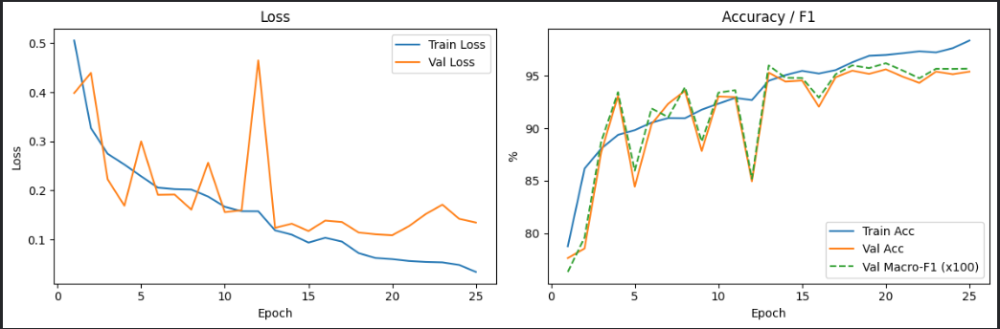
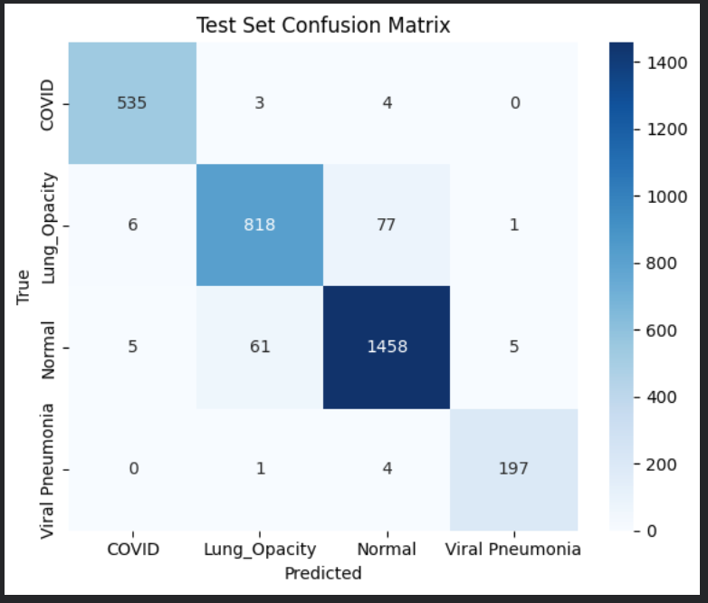
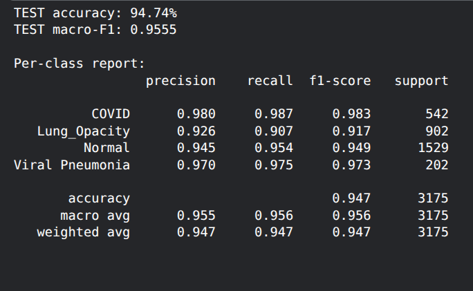

# PulmoScan AI 🫁 — COVID-19 Chest X-Ray Diagnostics

<div align="center">



[](https://python.org)
[](https://pytorch.org)
[](https://fastapi.tiangolo.com)
[](https://docker.com)
[](https://threejs.org)
[](LICENSE)

**[Wajid Ali](https://github.com/wajidcodes)**

</div>

---

## 🎯 What is this?

**PulmoScan AI** is a full-stack deep learning web application that classifies Chest X-Ray images into 4 categories using a trained ResNet-18 model, complete with:

- **3D interactive lung visualization** (Three.js) — highlights infected zones based on Grad-CAM attention
- **Grad-CAM heatmap overlay** — shows exactly which lung regions the AI focused on (not thresholding — actual gradient-weighted class activation maps)
- **FastAPI backend** — real-time inference with the trained model
- **Docker Compose** — one command to run everything

---

## 📊 Trained Model Performance

> Trained on the **COVID-19 Radiography Database v2** (Chowdhury / Rahman, 2020) — 21,165 images, 4 classes.
>
> Trained on Kaggle T4x2 GPU with scientifically rigorous methodology: class-weighted loss, learning rate scheduling, and early stopping by macro-F1.

| Metric | Score |
|---|---|
| **Test Accuracy** | **94.74%** |
| **Macro F1-Score** | **95.55%** |
| Epochs | 25 |
| Dataset | 21,165 images (4 classes) |
| Train/Val/Test Split | 70 / 15 / 15 (stratified, seed=42) |
| Class Weighting | Inverse-frequency (handles imbalance) |
| Training Time | ~1 hour on Kaggle T4x2 GPU |

### Per-Class Results (Test Set)

| Class | Precision | Recall | F1 | Support |
|---|---|---|---|---|
| **COVID-19** | 98.0% | 98.7% | **98.3%** | 542 |
| **Normal** | 94.5% | 95.4% | **94.9%** | 1529 |
| **Lung Opacity** | 92.6% | 90.7% | **91.7%** | 902 |
| **Viral Pneumonia** | 97.0% | 97.5% | **97.3%** | 202 |

### Training Artifacts

| Artifact | Description |
|---|---|
|  | Confusion matrix on the test set |
|  | Loss and accuracy training curves |
|  | Detailed per-class classification report |

---

## 🏗️ Architecture & Tech Stack

```
┌─────────────────────────────────────────────────────┐
│  Frontend (Nginx)                                   │
│  ├── Three.js    →  3D Interactive Lung Model       │
│  ├── Vanilla JS  →  Upload, Results, API calls      │
│  └── Pure CSS    →  Dark medical UI design          │
├─────────────────────────────────────────────────────┤
│  Backend (FastAPI + PyTorch)                        │
│  ├── ResNet-18   →  4-class classification          │
│  ├── Grad-CAM    →  Lung zone attention heatmaps    │
│  └── /predict    →  REST API endpoint               │
├─────────────────────────────────────────────────────┤
│  Docker Compose  →  Orchestrates both services      │
└─────────────────────────────────────────────────────┘
```

**Why ResNet-18?**
Standard, well-understood architecture with ImageNet pre-training. Achieves 94.7% accuracy at low computational cost — solid baseline before further optimization.

**Why Grad-CAM?**
Selvaraju et al. (ICCV 2017) — gradient-weighted class activation mapping. Shows *which pixels* influence the prediction, without any post-hoc thresholding. The heatmap zones are then mapped onto the 3D lung model for an intuitive visual explanation.

**Why Class-Weighted Loss?**
The dataset has 10,192 Normal vs only 1,345 Viral Pneumonia images (7.6× imbalance). Without weighting, the model would learn to guess "Normal" most of the time. Inverse-frequency weighting (Buda et al. Neural Networks 2018) corrects this.

---

## 📂 Project Structure

```
Covid-19-Test-Project/
├── docker-compose.yml           # Run everything with one command
│
├── backend/
│   ├── main.py                  # FastAPI inference API with Grad-CAM
│   ├── requirements.txt         # Python dependencies
│   └── Dockerfile
│
├── frontend/
│   ├── index.html               # Full UI (Three.js 3D lung + results)
│   ├── nginx.conf               # Reverse proxy to backend
│   ├── artifacts/               # Training result images (shown in UI)
│   └── Dockerfile
│
├── src/
│   ├── model.py                 # ResNet-18 definition
│   ├── dataset.py               # Dataset & transforms
│   └── gradcam.py               # Grad-CAM implementation
│
├── notebooks/
│   └── train_resnet18.ipynb     # Kaggle/Colab training notebook
│
├── models/
│   └── resnet18_covid.pth       # Trained weights
│
├── artifacts/
│   ├── Confusion_Matrix.png
│   ├── Training_Curves.png
│   ├── per_class_report.png
│   └── metrics.json             # All test metrics (machine-readable)
│
└── train.py                     # Local training script
```

---

## 🚀 Quick Start — Run with Docker

**Prerequisites:** Docker and Docker Compose installed.

```bash
# 1. Clone the repository
git clone https://github.com/wajidcodes/Detecting-COVID-19-with-Chest-X-Ray-using-PyTorch.git
cd Detecting-COVID-19-with-Chest-X-Ray-using-PyTorch

# 2. Add your user to the docker group (one-time setup, avoids sudo)
sudo usermod -aG docker $USER
newgrp docker

# 3. Run
docker compose up --build

# 4. Open in browser
# Web UI:   http://localhost:3000
# API Docs: http://localhost:8000/docs
```

The app starts immediately with the pre-trained model. Upload any chest X-ray PNG/JPG to get a diagnosis.

---

## 🧠 How the 3D Visualization Works

The 3D lung model is built with **Three.js** entirely in the browser — no external 3D files needed.

When you analyze an X-ray:
1. The backend runs **Grad-CAM** on `layer4` (last ResNet-18 conv block)
2. The resulting heatmap is divided into 4 zones: upper-left, lower-left, upper-right, lower-right
3. Each zone's average attention score is sent back to the frontend
4. Three.js renders glowing blobs on the 3D lung model at the corresponding zones
5. **Blue** = healthy/low attention · **Orange** = moderate · **Red** = high AI attention

This provides a fully interactive, in-browser 3D visualization to help understand the AI's diagnostic focus.

---

## 🏋️ Re-Training the Model (Cloud GPU)

### On Kaggle (Free T4x2 GPU — ~1 hour)

1. Go to [kaggle.com](https://www.kaggle.com) → **Create → New Notebook**
2. **File → Import Notebook** → upload `notebooks/train_resnet18.ipynb`
3. **Add Data** → search `COVID-19 Radiography Database` (v2 dataset, 21k images — already on Kaggle, no upload needed)
4. **Session options → Accelerator → GPU T4x2**
5. Update `data_dir` in Cell 3:
   ```python
   data_dir = '/kaggle/input/covid19-radiography-database/COVID-19_Radiography_Dataset'
   ```
6. **Run All** — takes approximately **~1 hour** on T4x2
7. Download `resnet18_covid_best.pth` → rename to `resnet18_covid.pth` → place in `models/`

---

## ⚠️ Medical Disclaimer

This software is for **research and educational purposes only**. It is **not** intended for clinical diagnosis, medical advice, or treatment decisions. Always consult a qualified healthcare professional. COVID-19 must be confirmed with RT-PCR or equivalent tests.

The Grad-CAM zones mapped onto the 3D lung illustration are AI attention approximations projected from 2D heatmaps, not CT-derived 3D segmentation.

---

## 📖 References

1. He et al. (2016). Deep Residual Learning for Image Recognition. CVPR 2016.
2. Selvaraju et al. (2017). Grad-CAM. ICCV 2017. DOI: 10.1109/ICCV.2017.74
3. Chowdhury et al. (2020). Can AI help in screening viral and COVID-19 pneumonia? IEEE Access 8.
4. Buda et al. (2018). A systematic study of the class imbalance problem. Neural Networks 106.
5. Deng et al. (2009). ImageNet: A large-scale hierarchical image database. CVPR 2009.

---

<div align="center">

Made with ❤️ by **[Wajid Ali](https://github.com/wajidcodes)**

[GitHub](https://github.com/wajidcodes) · [LinkedIn](https://www.linkedin.com/in/wajid-ali-developer/)

</div>
